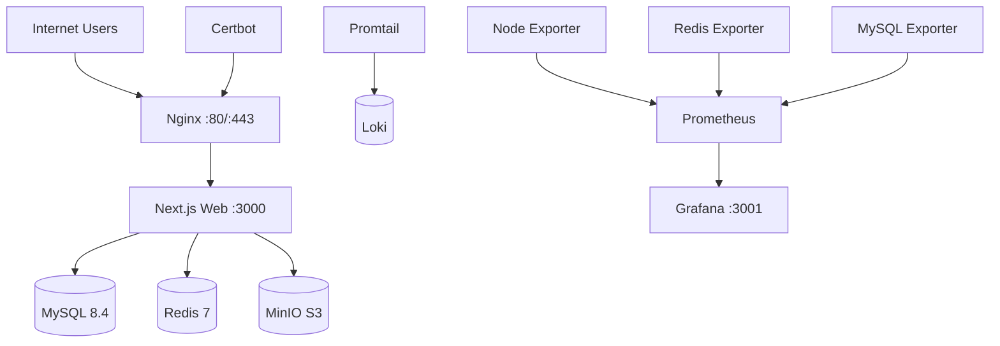

# ScarborMusic — Production Deployment Guide

Target platform: **Tencent Cloud CVM**, **CentOS Stream 9**, **Docker Compose** one-click production stack.

**Current default:** public IP **159.75.87.182** + **HTTP** only (no TLS).

| Item | Value |
|------|-------|
| Site URL | http://159.75.87.182 |
| Env template | `.env.production.ip.example` |
| Deploy script | `./scripts/deploy-ip.sh` |
| Cookie flag | `COOKIE_SECURE=false` |
| Object storage URL | `S3_PUBLIC_URL=http://159.75.87.182/storage` |

Chinese step-by-step: `docs/服务器部署教程.md`

---

## Architecture



| Service | Role | Host port |
|---------|------|-----------|
| nginx | Reverse proxy, gzip, `/storage` → MinIO | 80 |
| web | Next.js standalone (Node 22) | internal |
| mysql | Primary database | internal |
| redis | Cache, rate limit, sessions | internal |
| minio | Object storage (audio/images) | internal |
| grafana | Dashboards + logs UI | 3001 |
| prometheus | Metrics | internal |
| loki | Log aggregation | internal |

---

## 1. Server initialization (CentOS Stream 9)

```bash
sudo dnf update -y
sudo dnf install -y git curl vim

# Docker CE
sudo dnf config-manager --add-repo https://download.docker.com/linux/centos/docker-ce.repo
sudo dnf install -y docker-ce docker-ce-cli containerd.io docker-compose-plugin
sudo systemctl enable --now docker
sudo usermod -aG docker $USER

# Firewall
sudo firewall-cmd --permanent --add-service=http
sudo firewall-cmd --permanent --add-service=https
sudo firewall-cmd --permanent --add-port=3001/tcp  # Grafana (restrict to admin IP)
sudo firewall-cmd --reload
```

---

## 2. Deploy (IP + HTTP)

```bash
sudo mkdir -p /opt/scarbormusic
cd /opt/scarbormusic

# from tarball or git clone
cp .env.production.ip.example .env.production
vim .env.production   # replace change-me passwords; keep COOKIE_SECURE=false

chmod +x scripts/*.sh
./scripts/deploy-ip.sh
```

Open **http://159.75.87.182** — do **not** run `init-ssl.sh` in this mode.

---

## 3. Optional: domain + HTTPS

Point your domain A record to the server public IP, update `.env.production` (`https://`, `COOKIE_SECURE=true`), add nginx port `443:443`, then:

```bash
docker compose -f docker-compose.prod.yml --env-file .env.production --profile ssl up -d
./scripts/init-ssl.sh
```

Validate compose file before deploy:

```bash
docker compose -f docker-compose.prod.yml --env-file .env.production config
```

---

## 4. SSL (Let's Encrypt)

1. Ensure DNS resolves and port 80 is open.
2. Set `DOMAIN` and `CERTBOT_EMAIL` in `.env.production`.
3. Run:

```bash
./scripts/init-ssl.sh
```

Auto-renewal (cron daily at 03:00):

```cron
0 3 * * * /opt/scarbormusic/scripts/cert-renew.sh >> /var/log/scarbormusic-cert.log 2>&1
```

---

## 5. CI/CD (GitHub Actions)

Workflow: `.github/workflows/deploy.yml`

| Job | Action |
|-----|--------|
| lint | `npm run lint` |
| test | `npm run test` |
| build | `NODE_ENV=production npm run build` |
| docker | Push `web` + `nginx` images to GHCR |
| deploy | SSH to Tencent Cloud, `docker compose up -d` |

### Required GitHub Secrets

| Secret | Description |
|--------|-------------|
| `SSH_HOST` | Server public IP or hostname |
| `SSH_USER` | SSH user (e.g. `root` or deploy user) |
| `SSH_PRIVATE_KEY` | Private key PEM |
| `SSH_PORT` | Optional, default 22 |
| `DEPLOY_PATH` | e.g. `/opt/scarbormusic` |

---

## 6. Database backup

```bash
./scripts/mysql-backup.sh
```

Cron (daily 02:00):

```cron
0 2 * * * /opt/scarbormusic/scripts/mysql-backup.sh >> /var/log/scarbormusic-backup.log 2>&1
```

Backups stored in MinIO bucket `scarbormusic-backups/mysql/`, retained **30 days**.

### Restore

```bash
gunzip -c backup.sql.gz | docker compose -f docker-compose.prod.yml exec -T mysql \
  mysql -u scarbormusic -p scarbormusic
```

---

## 7. Operations scripts

| Script | Purpose |
|--------|---------|
| `scripts/deploy.sh` | Build & start full stack |
| `scripts/rollback.sh <tag>` | Roll back web/nginx image tag |
| `scripts/health-check.sh` | Verify nginx, web, mysql, redis |
| `scripts/restart.sh [service]` | Restart services |
| `scripts/cert-renew.sh` | Renew TLS + reload nginx |
| `scripts/init-ssl.sh` | First-time certificate |
| `scripts/mysql-backup.sh` | Dump + upload to MinIO |

---

## 8. Monitoring & logs

| URL | Service |
|-----|---------|
| `http://<server-ip>:3001` | Grafana (metrics + logs) |
| Prometheus | `http://prometheus:9090` (internal) |
| Loki | `http://loki:3100` (internal) |

Default Grafana login: values from `GRAFANA_ADMIN_USER` / `GRAFANA_ADMIN_PASSWORD`.

Datasources provisioned: **Prometheus**, **Loki**.

Log sources via Promtail:

- Docker container stdout (web, nginx, mysql, redis, minio)
- Nginx access/error logs

---

## 9. Upgrade flow

```bash
cd /opt/scarbormusic
git pull
export WEB_IMAGE=ghcr.io/<org>/ScarborMusic/web:sha-<commit>
docker compose -f docker-compose.prod.yml --env-file .env.production pull web
docker compose -f docker-compose.prod.yml --env-file .env.production up -d web
./scripts/health-check.sh
```

---

## 10. Troubleshooting

| Symptom | Check |
|---------|-------|
| 502 Bad Gateway | `docker logs scarbormusic-web`, wait for migrations |
| TLS error | `./scripts/init-ssl.sh`, `ls /etc/letsencrypt/live/$DOMAIN` in certbot volume |
| Upload fails | MinIO health, `S3_*` env vars, nginx `client_max_body_size 100m` |
| Rate limit issues | Redis connectivity `redis-cli ping` |
| DB connection | `DATABASE_URL` uses host `mysql` not `localhost` |

---

## 11. Remaining risks

- **Grafana port 3001** should be firewalled to admin IPs only.
- **MinIO console** is not exposed publicly by default; use SSH tunnel if needed.
- **Brotli** requires Alpine nginx module; falls back to gzip-only if module missing.
- **First deploy** runs in HTTP-only mode until `init-ssl.sh` completes.
- **Standalone image** size depends on Prisma + AWS SDK; monitor disk on small VMs.
