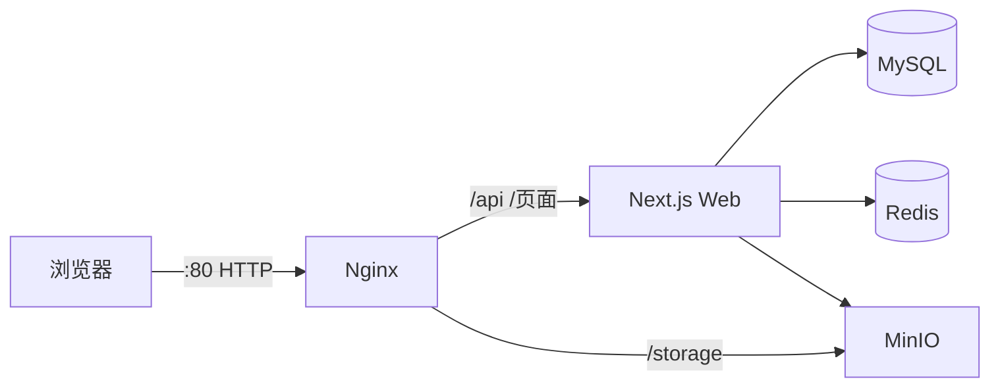

# ScarborMusic 部署方案（公网 IP + HTTP）

> 适用：腾讯云 CentOS，公网 IP **159.75.87.182**，仅 **HTTP**，无域名、无 HTTPS。

---

## 一、架构概览



| 组件 | 作用 | 对外端口 |
|------|------|----------|
| Nginx | 反向代理、静态缓存、MinIO 公网路径 | **80** |
| Web | 网站与 API | 内部 3000 |
| MySQL | 业务数据库 | 内部 |
| Redis | 缓存 / 限流 | 内部 |
| MinIO | 音频、封面存储 | 经 Nginx `/storage` |
| Grafana | 监控（可选） | **3001**（建议仅管理员 IP） |

**不启动**：Certbot、443（除非日后启用 `--profile ssl`）。

---

## 二、服务器要求

| 项目 | 建议 |
|------|------|
| 系统 | CentOS Stream 9 / Rocky 9 |
| CPU / 内存 | 2 核 4G 起，推荐 4 核 8G |
| 磁盘 | ≥ 40GB |
| 安全组 | 放行 **22**、**80**；3001 可选 |

---

## 三、获取代码（二选一）

### 方式 A：压缩包（无 Git）

**开发机打包：**

```bash
./scripts/package-release.sh
# 得到 dist/scarbormusic-deploy-YYYYMMDD.tar.gz
```

**上传到服务器：**

```bash
scp dist/scarbormusic-deploy-*.tar.gz root@159.75.87.182:/opt/
```

**服务器解压：**

```bash
mkdir -p /opt/scarbormusic
tar -xzf /opt/scarbormusic-deploy-*.tar.gz -C /opt/scarbormusic
cd /opt/scarbormusic
# 必须能看到 docker-compose.prod.yml
ls docker-compose.prod.yml scripts/deploy-ip.sh
```

### 方式 B：Git（可更新）

```bash
cd /root
git clone -b cursor/phase1-infrastructure-d32e \
  https://github.com/924192753/ScarborMusic.git ScarborMusic
cd ScarborMusic
git pull   # 后续更新
```

> 若你已在目录 `ScarborMusic-cursor-phase1-infrastructure-d32e`，执行 `git pull` 拉取含 **shouldUseSecureCookies** 修复的最新代码后再部署。

---

## 四、安装 Docker（仅首次）

```bash
sudo dnf update -y
sudo dnf install -y curl vim tar gzip openssl
sudo dnf config-manager --add-repo https://download.docker.com/linux/centos/docker-ce.repo
sudo dnf install -y docker-ce docker-ce-cli containerd.io docker-compose-plugin
sudo systemctl enable --now docker
sudo usermod -aG docker $USER
```

重新 SSH 登录后：`docker compose version`

---

## 五、配置环境变量

### 5.1 自动生成（推荐）

```bash
chmod +x scripts/*.sh
./scripts/setup-env.sh
```

会基于 `.env.production.ip.example` 生成 `.env.production`，并填充 JWT、MinIO、Grafana 等随机密钥。

### 5.2 手动配置

```bash
cp .env.production.ip.example .env.production
vim .env.production
```

**检查清单（缺一不可）：**

| 检查项 | 正确示例 |
|--------|----------|
| 无 `change-me` 字样 | 已全部替换 |
| `DOMAIN` | `159.75.87.182` |
| `NEXT_PUBLIC_APP_URL` | `http://159.75.87.182` |
| `COOKIE_SECURE` | `false` |
| `S3_PUBLIC_URL` | `http://159.75.87.182/storage` |
| `DATABASE_URL` 密码 | 与 `MYSQL_PASSWORD` 一致 |

MySQL 若已自定密码（如 `scarbor123`），保持三处一致即可，不必被 `setup-env.sh` 覆盖。

---

## 六、部署执行

```bash
cd /opt/scarbormusic   # 或你的项目目录
./scripts/deploy-ip.sh
```

脚本流程：

1. 检查 `.env.production` 无 `change-me`
2. `docker compose build`（Web 约 7～15 分钟，视机器而定）
3. 启动 MySQL → Redis → MinIO → Web → Nginx → 监控/日志
4. 容器内执行 `prisma migrate deploy`
5. 运行 `health-check.sh`

**禁止执行** `scripts/init-ssl.sh`（当前为 HTTP 模式）。

---

## 七、验证

```bash
./scripts/health-check.sh
curl -s http://127.0.0.1/health
curl -I http://159.75.87.182/
docker compose -f docker-compose.prod.yml --env-file .env.production ps
```

| 验证项 | 预期 |
|--------|------|
| 首页 | http://159.75.87.182 可打开 |
| 注册/登录 | 成功（依赖 `COOKIE_SECURE=false`） |
| 上传封面 | 图片 URL 为 `http://159.75.87.182/storage/...` |

---

## 八、更新 / 重新部署

代码更新后：

```bash
git pull
# 或重新上传解压新压缩包

./scripts/deploy-ip.sh
```

仅改 `.env.production` 时：

```bash
docker compose -f docker-compose.prod.yml --env-file .env.production build web
docker compose -f docker-compose.prod.yml --env-file .env.production up -d web nginx
```

---

## 九、常用运维

```bash
# 状态
docker compose -f docker-compose.prod.yml --env-file .env.production ps

# 日志
docker logs -f scarbormusic-web
docker logs -f scarbormusic-nginx

# 重启
./scripts/restart.sh web

# 备份
./scripts/mysql-backup.sh
```

---

## 十、故障排查

| 现象 | 原因与处理 |
|------|------------|
| `react-hooks/rules-of-hooks` / `useSecureCookies` | 代码过旧，执行 `git pull` 或换最新压缩包 |
| `deploy-ip.sh` 提示 change-me | 运行 `./scripts/setup-env.sh` 或手动改 JWT/S3/Grafana |
| 构建卡在 `npm run build` 很久 | 正常，等待完成；内存不足时 `free -h` 检查 |
| 502 Bad Gateway | `docker logs scarbormusic-web`，等 MySQL 健康后 `restart web` |
| 能浏览不能登录 | `COOKIE_SECURE=false`，URL 必须为 `http://` |
| 图片 404 | 确认 Nginx `/storage` 与 `S3_PUBLIC_URL` 一致 |
| Web 重启、`Cannot find module 'effect'` | 代码过旧，需含 `prisma-cli` 阶段的 Dockerfile，`git pull` 后重建 web |

---

## 十一、安全说明

- 当前为 **HTTP 明文**，密码在网络上可被窃听，适合内测/演示。
- 正式上线建议：绑定域名 → HTTPS → `COOKIE_SECURE=true` → `--profile ssl`。
- 勿将 `.env.production` 提交到公开仓库。

---

## 十二、一键命令汇总（复制执行）

```bash
# === 首次部署（在服务器项目根目录）===
chmod +x scripts/*.sh
./scripts/setup-env.sh          # 或手动 vim .env.production
./scripts/deploy-ip.sh
curl -I http://159.75.87.182/

# === 访问 ===
# 网站: http://159.75.87.182
# Grafana: http://159.75.87.182:3001 （建议限制 IP）
```
